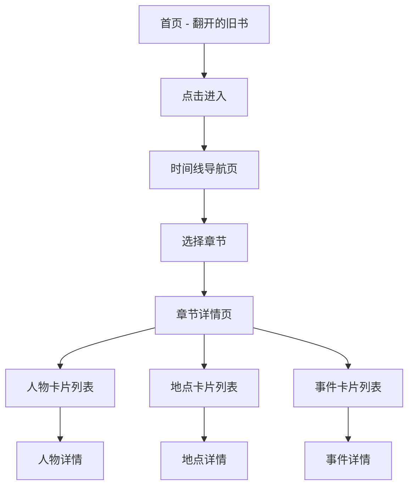

## 1. 产品概述

《昨日的世界》是一个基于斯蒂芬·茨威格同名回忆录的交互式Web项目，旨在以数字化方式重现书中描绘的欧洲黄金时代。通过人物卡片、地点卡片、事件卡片等形式，记录和探索书中提到的人物、城市、历史事件与时代氛围，让读者以沉浸式的方式重温那个"昨日的世界"。

- 核心目标：以视觉化、交互化的方式呈现《昨日的世界》中的历史人文元素
- 目标用户：文学爱好者、历史爱好者、茨威格作品读者
- 产品价值：将文学作品中的零散信息系统化、可视化，提供独特的阅读延展体验

## 2. 核心功能

### 2.1 用户角色
| 角色 | 注册方式 | 核心权限 |
|------|----------|----------|
| 访客 | 无需注册 | 浏览所有内容、使用时间线导航、查看卡片详情 |

### 2.2 功能模块
1. **首页**：翻开的旧书动画、项目标题、进入入口
2. **时间线导航**：按年代顺序展示书中章节与历史时期
3. **人物卡片**：展示书中提及的历史人物及其简介
4. **地点卡片**：展示书中提到的城市与地点
5. **事件卡片**：展示重要历史事件
6. **章节页面**：每个章节对应的人物、地点、事件集合

### 2.3 页面详情
| 页面名称 | 模块名称 | 功能描述 |
|----------|----------|----------|
| 首页 | 翻书动画 | 旧书翻开效果，书页微动，标题浮现 |
| 首页 | 进入按钮 | 点击后进入主内容区 |
| 时间线页 | 时间线轴 | 纵向时间线，标注年代与章节名称 |
| 时间线页 | 章节入口 | 点击章节进入对应内容页 |
| 章节详情页 | 人物卡片列表 | 网格布局展示该章节相关人物 |
| 章节详情页 | 地点卡片列表 | 网格布局展示该章节相关地点 |
| 章节详情页 | 事件卡片列表 | 网格布局展示该章节相关事件 |
| 卡片详情 | 人物详情 | 人物照片、生平简介、书中引用 |
| 卡片详情 | 地点详情 | 城市图片、历史背景、书中描写 |
| 卡片详情 | 事件详情 | 事件始末、历史意义、相关人物 |

## 3. 核心流程

用户从首页开始，看到一本正在翻开的旧书，点击进入后看到时间线导航。用户可以沿着时间线浏览不同的历史时期和章节，点击某个章节后进入详情页，查看该章节相关的人物、地点和事件卡片。点击卡片可以查看更详细的信息。

## 4. 用户界面设计

### 4.1 设计风格
- **主色调**：米黄色（纸张色）、深棕色（墨水色）、赭石色（装饰色）、烫金色（点缀色）
- **整体风格**：旧欧洲图书馆风格、泛黄纸张质感、古典优雅
- **装饰元素**：花纹边框、烫金效果、毛边纸张、旧书脊装饰
- **字体**：衬线字体（标题用装饰性衬线字体，正文用易读衬线字体）
- **质感**：纸张纹理、做旧效果、轻微的折痕与泛黄

### 4.2 页面设计概述
| 页面名称 | 模块名称 | UI元素 |
|----------|----------|--------|
| 首页 | 翻书动画 | 打开的旧书、飘动的书页、烫金标题、柔和的灯光效果 |
| 时间线页 | 时间线轴 | 纵向轴线、年代标签、章节卡片、滚动微动效 |
| 章节详情页 | 卡片网格 | 泛黄卡片、装饰边框、悬浮效果、错落布局 |
| 卡片详情 | 详情页 | 大幅图片、引用块、装饰性分隔线、返回按钮 |

### 4.3 响应式
- 桌面端优先设计
- 平板端：卡片网格自适应列数
- 移动端：单列布局，时间线改为横向滑动
- 触摸优化：增大点击区域，适配手势操作

### 4.4 动效设计
- 首页：书页缓慢翻开动画，标题淡入浮现
- 卡片：悬停时轻微上浮、阴影加深、边框金光微闪
- 时间线：滚动时节点依次点亮
- 页面切换：淡入淡出过渡，模拟翻页效果
