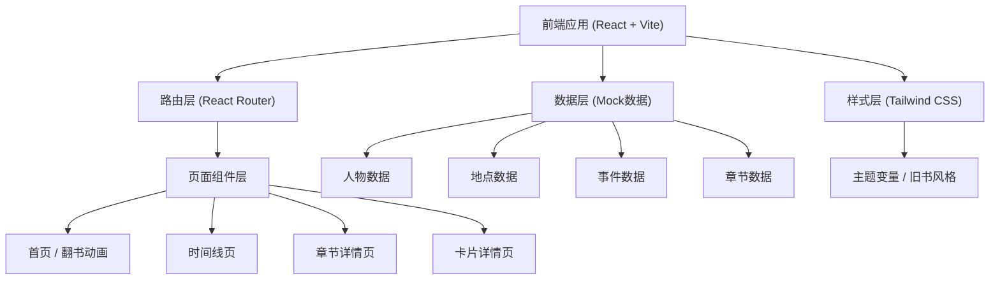
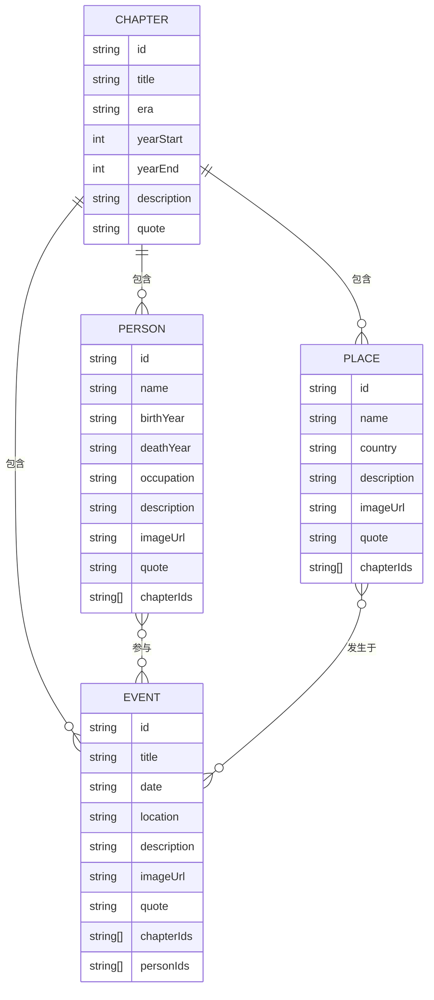

## 1. 架构设计



## 2. 技术描述

- **前端框架**：React@18 + TypeScript
- **构建工具**：Vite@5
- **样式方案**：Tailwind CSS@3 + CSS Variables
- **路由方案**：React Router DOM@6
- **动画方案**：CSS Animations + Framer Motion
- **数据方案**：本地 Mock 数据（JSON/TS对象）
- **字体方案**：Google Fonts 衬线字体
- **图标方案**：React Icons（古典风格图标）

## 3. 路由定义

| 路由 | 用途 |
|------|------|
| / | 首页 - 翻开的旧书动画与进入入口 |
| /timeline | 时间线导航页 |
| /chapter/:id | 章节详情页 - 展示该章节的人物、地点、事件 |
| /person/:id | 人物详情页 |
| /place/:id | 地点详情页 |
| /event/:id | 事件详情页 |

## 4. 数据模型

### 4.1 数据模型定义



### 4.2 TypeScript 类型定义

```typescript
interface Chapter {
  id: string;
  title: string;
  era: string;
  yearStart: number;
  yearEnd: number;
  description: string;
  quote: string;
}

interface Person {
  id: string;
  name: string;
  birthYear: number;
  deathYear: number;
  occupation: string;
  description: string;
  imageUrl: string;
  quote: string;
  chapterIds: string[];
}

interface Place {
  id: string;
  name: string;
  country: string;
  description: string;
  imageUrl: string;
  quote: string;
  chapterIds: string[];
}

interface Event {
  id: string;
  title: string;
  date: string;
  location: string;
  description: string;
  imageUrl: string;
  quote: string;
  chapterIds: string[];
  personIds: string[];
}
```

## 5. 项目目录结构

```
src/
├── assets/           # 静态资源（图片、字体等）
├── components/       # 公共组件
│   ├── Book.tsx      # 翻书动画组件
│   ├── Card.tsx      # 卡片基础组件
│   ├── PersonCard.tsx
│   ├── PlaceCard.tsx
│   ├── EventCard.tsx
│   └── Timeline.tsx  # 时间线组件
├── data/             # Mock数据
│   ├── chapters.ts
│   ├── persons.ts
│   ├── places.ts
│   └── events.ts
├── pages/            # 页面组件
│   ├── Home.tsx
│   ├── Timeline.tsx
│   ├── Chapter.tsx
│   ├── PersonDetail.tsx
│   ├── PlaceDetail.tsx
│   └── EventDetail.tsx
├── styles/           # 全局样式与主题
│   └── theme.css
├── types/            # TypeScript类型定义
│   └── index.ts
├── App.tsx
├── main.tsx
└── index.css
```

## 6. 技术要点

1. **CSS 变量主题**：使用CSS变量定义颜色、字体、间距等，确保旧书风格统一
2. **纸张质感**：通过CSS渐变、纹理、box-shadow模拟泛黄纸张效果
3. **翻书动画**：使用CSS 3D transform + perspective实现翻书效果
4. **卡片悬浮效果**：hover时上浮、阴影加深、金色边框微闪
5. **时间线动画**：Intersection Observer实现滚动触发动画
6. **响应式设计**：Tailwind响应式断点适配多端
